# 📱 Aplicación Móvil Chrystal

Una aplicación móvil completa para gestión comercial, desarrollada con React Native y Expo. Permite administrar productos, clientes, presupuestos y vendedores con funcionalidad offline completa.

## 📸 Capturas de pantalla

<div align="center">
  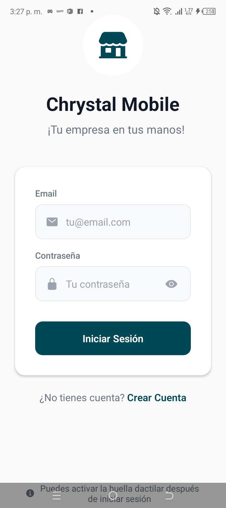
  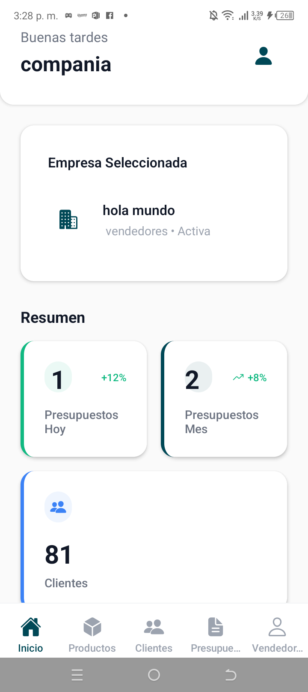
  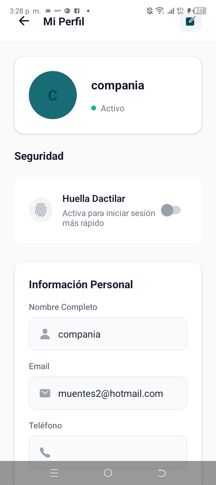
  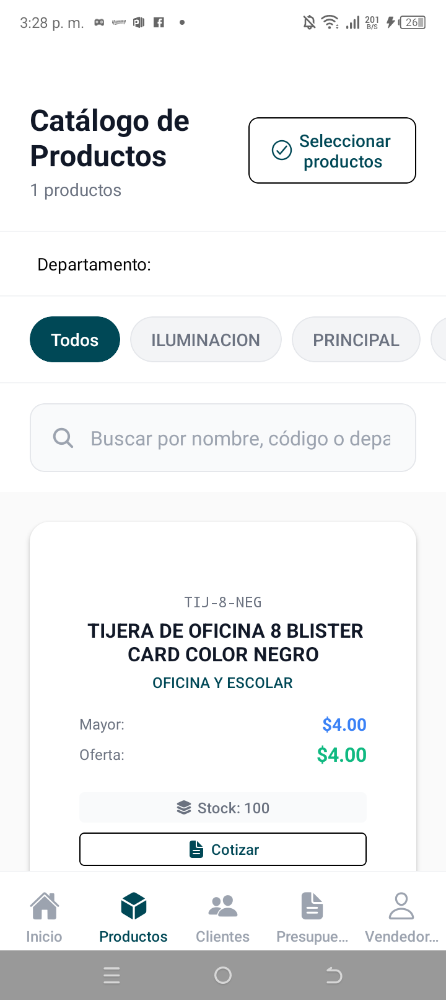
  
  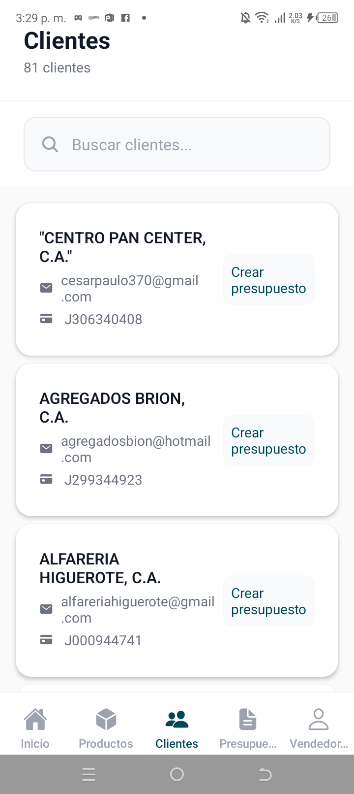
  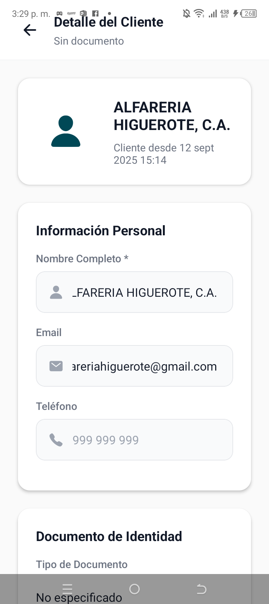
  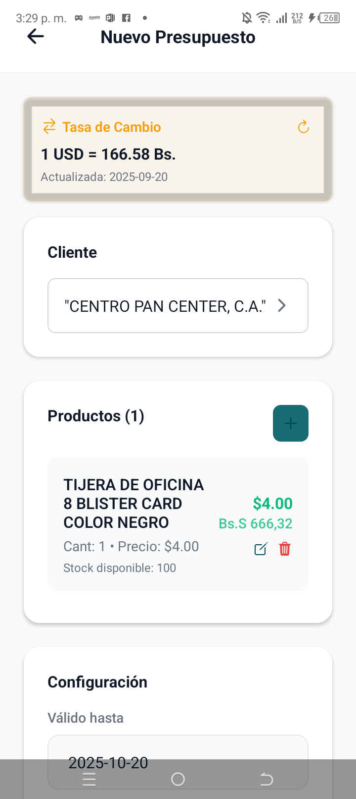
  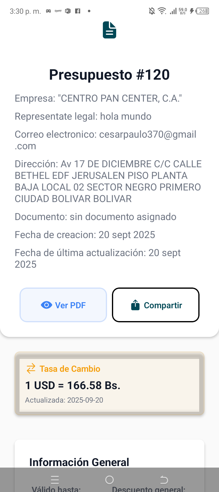
  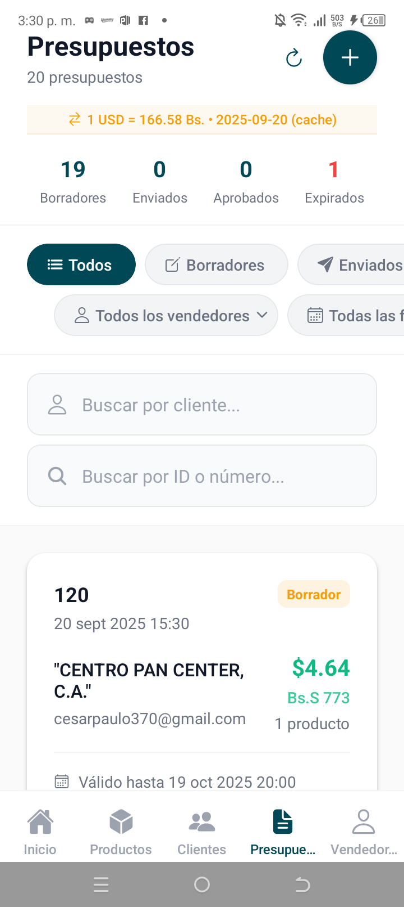
  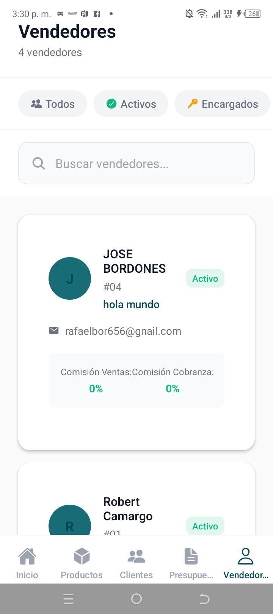
</div>

## 🌟 Características Principales

- 📦 **Gestión de Productos** - Catálogo completo con códigos, precios y stock
- 👥 **Administración de Clientes** - Base de datos completa de clientes
- 📄 **Presupuestos Inteligentes** - Creación, seguimiento y conversión automática USD/Bs
- 👤 **Gestión de Vendedores** - Control de equipos de venta y comisiones
- 🔄 **Funcionalidad Offline** - Trabaja sin conexión con sincronización automática
- 💱 **Conversión de Monedas** - Tasa BCV actualizada automáticamente

---

## 📸 Capturas de Pantalla

### 🏠 Panel Principal (Dashboard)
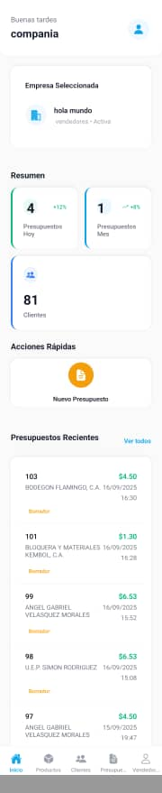 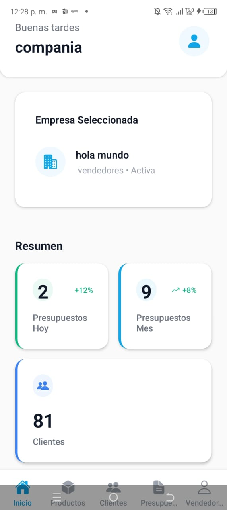

El dashboard principal muestra:
- **Saludo personalizado** según la hora del día
- **Empresa seleccionada** con información de vendedores
- **Métricas del día y mes** (presupuestos creados, clientes)
- **Navegación principal** con 5 secciones principales

---

### 👤 Gestión de Perfil
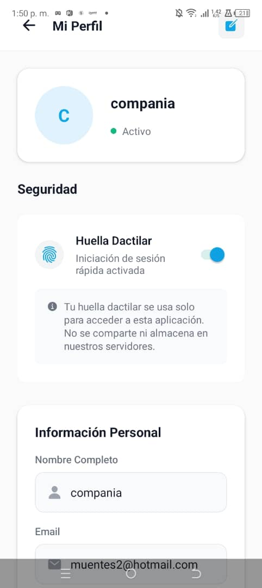

**Configuración del Usuario:**
- ✅ **Información personal** - Nombre y email
- 🔐 **Seguridad biométrica** - Huella dactilar para acceso rápido
- 🛡️ **Privacidad** - Datos almacenados localmente, no en servidores externos

**Características de Seguridad:**
- Activación/desactivación de huella dactilar
- Información clara sobre uso de datos biométricos
- Interfaz intuitiva con iconografía clara

---

### 👥 Gestión de Vendedores
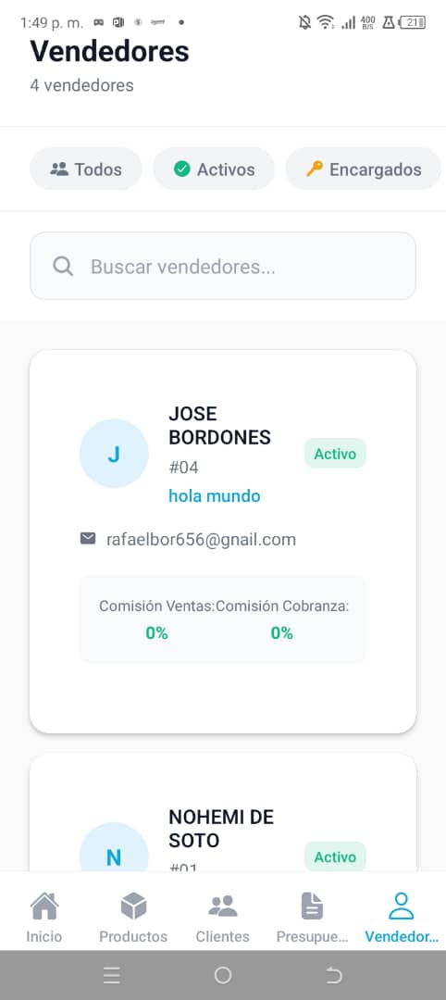

**Lista Completa de Vendedores:**
- 📊 **Información detallada** por vendedor
- 🏷️ **Códigos únicos** (#04, #01, etc.)
- ✅ **Estados activos/inactivos**
- 📧 **Datos de contacto** (email, descripciones)
- 💰 **Comisiones configurables** (ventas y cobranza)

**Filtros Disponibles:**
- `Todos` - Ver lista completa
- `Activos` - Solo vendedores activos
- `Encargados` - Vendedores con permisos especiales

---

### 📄 Creación de Presupuestos
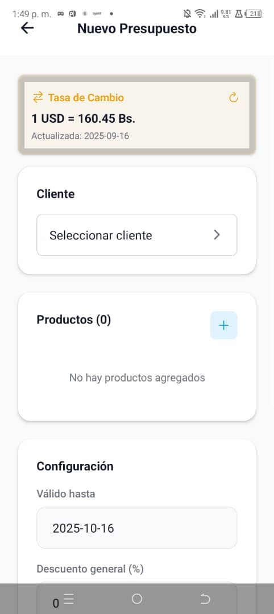

**Proceso de Creación:**
1. **💱 Tasa de Cambio** - Actualizada automáticamente (1 USD = 160.45 Bs.)
2. **👤 Selección de Cliente** - Obligatorio antes de continuar
3. **📦 Agregar Productos** - Botón "+" para añadir del catálogo
4. **⚙️ Configuración**:
   - Fecha de validez (válido hasta)
   - Descuento general en porcentaje

**Características:**
- Fecha actualizada en tiempo real (2025-09-16)
- Interfaz clara y paso a paso
- Validación de campos obligatorios

---

### 📋 Gestión de Presupuestos
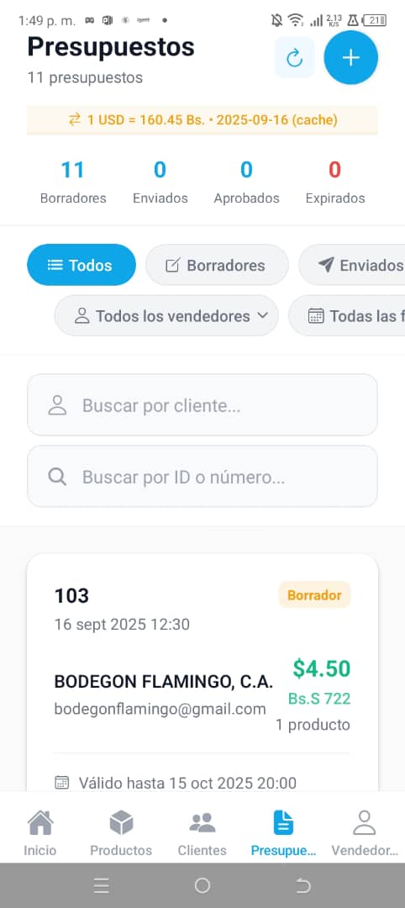

**Panel de Control Completo:**
- 🔄 **Tasa BCV en tiempo real** con cache y botón de actualización
- 📊 **Resumen de estados**: 11 Borradores, 0 Enviados, 0 Aprobados, 0 Expirados
- 🔍 **Filtros múltiples**: Por estado (Todos, Borradores, Enviados)
- 🔎 **Búsquedas dobles**:
  - Por nombre de cliente
  - Por ID o número de presupuesto

**Ejemplo de Presupuesto:**
- **ID**: #103
- **Cliente**: BODEGON FLAMINGO, C.A.
- **Fecha**: 16 sept 2025 12:30
- **Monto**: $4.50 (Bs.S 722)
- **Estado**: Borrador
- **Validez**: Hasta 15 oct 2025 20:00

---

### 👥 Base de Clientes
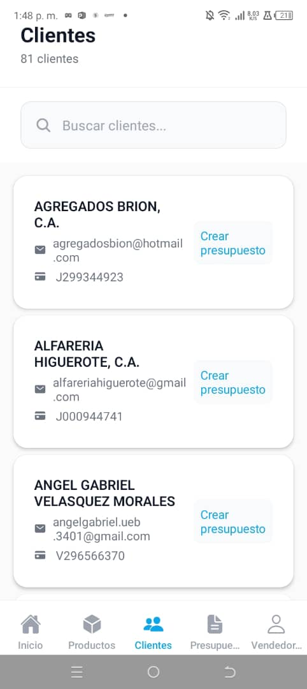

**Gestión Completa de Clientes:**
- 📊 **81 clientes** registrados en el sistema
- 🔍 **Búsqueda inteligente** por nombre, email o teléfono
- 📞 **Información completa**:
  - Nombres completos
  - Emails de contacto
  - Números telefónicos
  - Documentos de identificación

**Ejemplos de Clientes:**
1. **AGREGADOS BRION, C.A.**
   - Email: agregadosbion@hotmail.com
   - Tel: J299344923

2. **ALFARERIA HIGUEROTE, C.A.**
   - Email: alfereriahiguerote@gmail.com
   - Tel: J000944741

3. **ANGEL GABRIEL VELASQUEZ MORALES**
   - Email: angelgabriel.ueb.3401@gmail.com
   - Tel: V296566370

**Acción Rápida:** Botón azul "Crear presupuesto" para cada cliente

---

### 📦 Catálogo de Productos
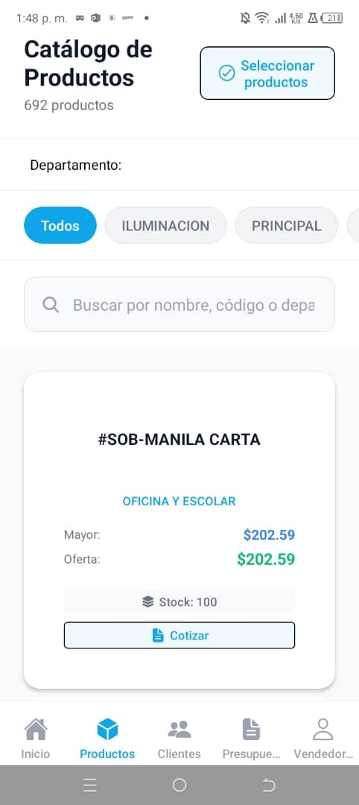

**Catálogo Completo:**
- 📊 **692 productos** disponibles
- 🏷️ **Filtros por departamento**: Todos, Iluminación, Principal
- 🔍 **Búsqueda avanzada** por nombre, código o departamento
- ✅ **Selección múltiple** para presupuestos masivos

**Ejemplo de Producto: #SOB-MANILA CARTA**
- **Categoría**: OFICINA Y ESCOLAR
- **Precios diferenciados**:
  - Mayor: $202.59 (precio al por mayor)
  - Oferta: $202.59 (precio de venta)
- **Stock**: 📦 100 unidades disponibles
- **Acción rápida**: 💳 Botón "Cotizar"

**Características del Catálogo:**
- Información centrada y clara
- Códigos prominentes para identificación rápida
- Indicadores de stock visibles
- Precios diferenciados por tipo de venta

---

## 🛠️ Tecnologías Utilizadas

### Frontend
- **React Native** - Framework principal
- **Expo** - Plataforma de desarrollo
- **TypeScript** - Tipado estático
- **React Navigation** - Navegación entre pantallas

### Backend & API
- **API REST** - https://chrystal.com.ve/chrystalmobile.chrystal.com.ve/public/api
- **Autenticación JWT** - Tokens seguros
- **Sincronización en tiempo real**

### Funcionalidades Especiales
- **Modo Offline** - Funciona sin conexión
- **AsyncStorage** - Persistencia local
- **NetInfo** - Detección de conectividad
- **Conversión de monedas** - BCV automático

---

## 🚀 Instalación y Configuración

### Prerrequisitos
```bash
node >= 16.0.0
npm >= 8.0.0
expo-cli >= 6.0.0
```

### Instalación
```bash
# Clonar repositorio
git clone https://github.com/tu-usuario/chrystal-mobile.git
cd chrystal-mobile

# Instalar dependencias
npm install

# Dependencias específicas para offline
npm install @react-native-community/netinfo
npm install @react-native-async-storage/async-storage

# Iniciar en desarrollo
npx expo start
```

### Configuración de API
```typescript
// services/api.ts
const BASE_URL = 'https://chrystal.com.ve/chrystalmobile.chrystal.com.ve/public/api';
```

---

## 📱 Navegación de la App

### Barra de Navegación Principal
La aplicación cuenta con 5 secciones principales accesibles desde la barra inferior:

| Ícono | Sección | Funcionalidad |
|-------|---------|---------------|
| 🏠 | **Inicio** | Dashboard con métricas y resumen |
| 📦 | **Productos** | Catálogo completo con 692+ productos |
| 👥 | **Clientes** | Base de datos con 81+ clientes |
| 📄 | **Presupuestos** | Gestión completa de cotizaciones |
| 👤 | **Vendedores** | Administración de equipo de ventas |

---

## 🔄 Funcionalidad Offline

### Características Offline
- ✅ **Navegación completa** sin conexión
- ✅ **Caché inteligente** de productos y clientes
- ✅ **Creación de presupuestos** offline
- ✅ **Sincronización automática** al recuperar conexión
- ✅ **Indicadores visuales** de estado de conexión

### Flujo de Trabajo Offline
1. **Sin Conexión**: App detecta y muestra banner de estado
2. **Uso Normal**: Usuario puede ver productos, clientes y crear presupuestos
3. **Almacenamiento Local**: Datos se guardan temporalmente
4. **Recuperación**: Al volver online, sincronización automática
5. **Resolución**: Datos temporales se actualizan con IDs del servidor

---

## 🔐 Seguridad y Autenticación

### Características de Seguridad
- 🔐 **Autenticación JWT** - Tokens seguros
- 👆 **Huella dactilar** - Acceso biométrico opcional
- 🛡️ **Datos locales** - Información sensible no se almacena en servidores externos
- 🔄 **Sesiones seguras** - Auto-logout por seguridad
- 📱 **Almacenamiento cifrado** - AsyncStorage protegido

### Configuración Biométrica
Como se muestra en la imagen del perfil:
- Activación fácil con switch
- Información clara sobre el uso de datos
- Almacenamiento solo local, no en servidores
- Acceso rápido sin comprometer seguridad

---

## 💱 Conversión de Monedas

### Tasa BCV Automática
- **Actualización diaria** de la tasa USD a Bolívares
- **Cache inteligente** para uso offline
- **Indicador visual** de última actualización
- **Botón de actualización manual** disponible

### Ejemplo de Conversión
```
1 USD = 160.45 Bs.
Actualizada: 2025-09-16 (cache)
```

Los presupuestos muestran automáticamente:
- Monto en USD: $4.50
- Equivalente en Bs: Bs.S 722

---

## 📊 Métricas y Reportes

### Dashboard Metrics
Según se muestra en las imágenes del dashboard:

| Métrica | Valor Actual | Tendencia |
|---------|-------------|-----------|
| Presupuestos Hoy | 2 | +12% ⬆️ |
| Presupuestos Mes | 9 | +8% ⬆️ |
| Total Clientes | 81 | Estable |

### Estados de Presupuestos
- **11 Borradores** - En proceso de creación
- **0 Enviados** - Enviados a clientes
- **0 Aprobados** - Confirmados por clientes  
- **0 Expirados** - Fuera de fecha de validez

---

## 🎯 Casos de Uso Principales

### 1. Vendedor Móvil
```
Vendedor → Ver Productos → Seleccionar Items → 
Elegir Cliente → Crear Presupuesto → Enviar
```

### 2. Gestión de Cartera
```
Empresa → Ver Vendedores → Revisar Comisiones → 
Analizar Presupuestos → Generar Reportes
```

### 3. Atención al Cliente
```
Cliente Llama → Buscar en Base → Ver Historial → 
Crear Nuevo Presupuesto → Enviar por Email
```

---

## 🐛 Solución de Problemas

### Problemas Comunes

**🔴 Error de Conexión**
```bash
# Verificar URL de API
console.log('API URL:', BASE_URL);

# Verificar conectividad
npx react-native info
```

**🟡 Problemas de Cache**
```bash
# Limpiar cache de desarrollo
npx expo start --clear

# Limpiar AsyncStorage
# En la app: Configuración → Limpiar Datos
```

**🔵 Sincronización Offline**
```bash
# Verificar NetInfo
import NetInfo from '@react-native-community/netinfo';
NetInfo.fetch().then(state => console.log(state));
```

---

## 🤝 Contribución

### Estructura del Proyecto
```
├── app/
│   ├── (auth)/          # Pantallas de autenticación
│   ├── (tabs)/          # Pantallas principales (mostradas en imágenes)
│   │   ├── index.tsx    # Dashboard
│   │   ├── products.tsx # Catálogo de productos
│   │   ├── customers.tsx# Lista de clientes
│   │   ├── quotes.tsx   # Gestión de presupuestos
│   │   └── sellers.tsx  # Gestión de vendedores
│   └── profile/         # Configuración de perfil
├── components/
│   ├── ui/              # Componentes base
│   └── offline/         # Componentes offline
├── services/
│   ├── api.ts           # Servicios API
│   └── offlineService.ts# Servicios offline
└── hooks/               # Hooks personalizados
```

### Guidelines de Desarrollo
1. **TypeScript First** - Todos los archivos en TS
2. **Componentes Reutilizables** - UI consistente
3. **Offline Support** - Todas las funciones deben funcionar sin conexión
4. **Testing** - Tests unitarios para funciones críticas

---

## 📄 Licencia

Este proyecto está bajo la Licencia MIT. Ver `LICENSE` para más detalles.

---

## 📞 Soporte y Contacto

- 🌐 **Sitio Web**: https://chrystal.com.ve
- 📧 **Email**: soporte@chrystal.com.ve  
- 📱 **App Store**: *Próximamente*
- 🤖 **Play Store**: *Próximamente*

---

## 🎉 Estado del Proyecto

- ✅ **Dashboard** - Funcional con métricas en tiempo real
- ✅ **Gestión de Productos** - 692+ productos catalogados
- ✅ **Base de Clientes** - 81+ clientes registrados
- ✅ **Presupuestos** - Creación y seguimiento completo
- ✅ **Vendedores** - Gestión de equipos de venta
- ✅ **Modo Offline** - Funcionalidad completa sin conexión
- ✅ **Conversión BCV** - Actualización automática de tasas
- ✅ **Seguridad Biométrica** - Huella dactilar implementada

---

*Última actualización: Septiembre 2025*
*Versión: 2.0.0*
*Build: Estable para producción*